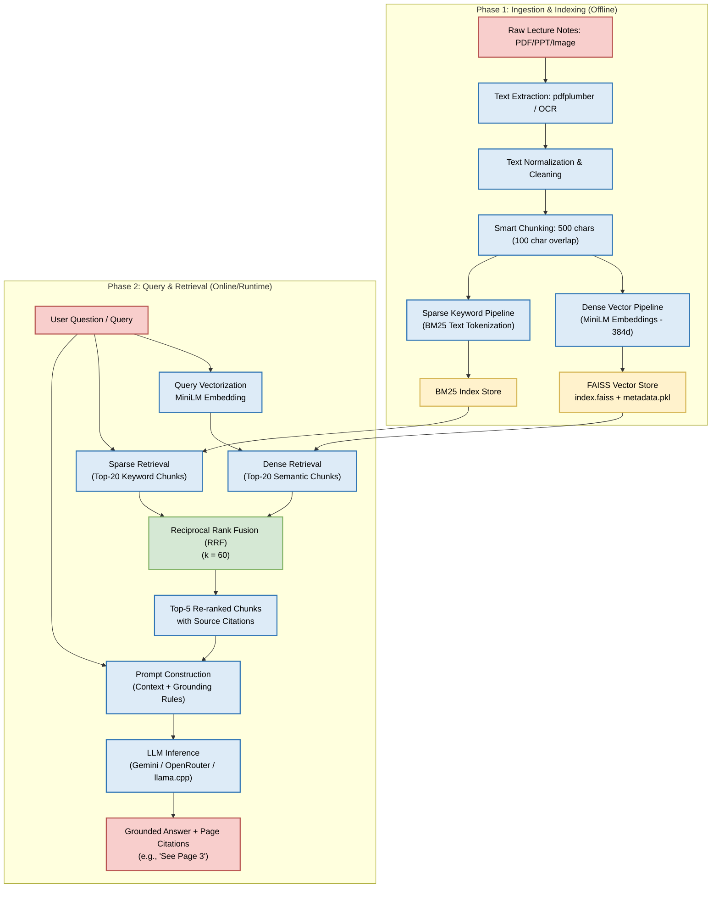

# Hybrid RAG Pipeline Flowchart

This document provides a detailed visual representation and explanation of the hybrid Retrieval-Augmented Generation (RAG) pipeline implemented in this project.

## Workflow Flowchart

## Detailed Phase Reference

### Phase 1: Ingestion & Indexing
1. **Raw Lecture Notes:** The pipeline supports digital/scanned PDFs and image formats.
2. **Text Extraction:** Implemented in [pdf_loader.py](../app/services/pdf_loader.py).
3. **Smart Chunking:** Text is split using character boundaries of 500 characters with a 100-character overlap to maximize recall and citation accuracy. Implemented in [chunker.py](../app/services/chunker.py) and [pdf_chunking.py](../app/services/pdf_chunking.py).
4. **Dense Vector Pipeline:** Embeddings are generated using `sentence-transformers` (`all-MiniLM-L6-v2`) in [embedding.py](../app/services/embedding.py) and saved to FAISS using [vector_store.py](../app/services/vector_store.py).
5. **Sparse Keyword Pipeline:** Chunks are indexed in a BM25 model implemented in [bm25_index.py](../retrieval/bm25_index.py).

### Phase 2: Query & Retrieval
1. **Query Vectorization:** Converts the user query to a 384d vector using [embedding.py](../app/services/embedding.py).
2. **Dense & Sparse Retrieval:** Executed in parallel in [dense_retriever.py](../retrieval/dense_retriever.py) and [bm25_index.py](../retrieval/bm25_index.py) (orchestrated by [hybrid_retriever.py](../retrieval/hybrid_retriever.py)).
3. **Reciprocal Rank Fusion (RRF):** Fuses ranking scores using $RRF = \frac{1}{60 + \text{rank}}$ implemented in [hybrid_retriever.py](../retrieval/hybrid_retriever.py).
4. **LLM Generation:** Uses system prompting constraints to limit hallucination and ensure grounded answers. Orchestrated via [local_rag.py](../app/services/local_rag.py) and [rag_pipeline.py](../app/services/rag_pipeline.py).
